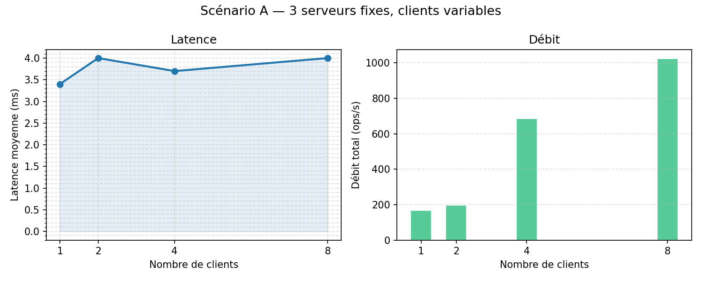
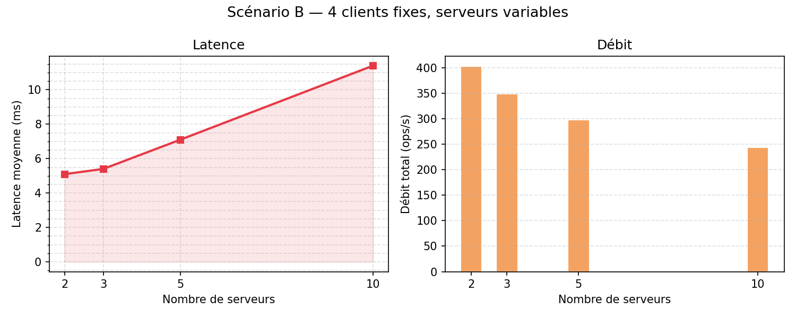

# Rapport — Éditeur collaboratif

## Auteurs

* NICAISE Enzo
* NGUYEN Ngoc Dang Nguyen

---

## Serveur centralisé

Notre premier choix d'implémentation a été de représenter le document partagé par une `List<String>`, chaque élément correspondant à une ligne. Nous avons associé à ce document une `List<Integer>` de versions ligne par ligne, pour pouvoir détecter les modifications concurrentes au niveau de la couche cliente. Ces deux structures sont protégées par des blocs `synchronized` sur l'objet serveur, de façon à sérialiser les accès sans avoir recours à un verrou externe.

En tâche 1, le mode de fonctionnement est entièrement en *pull* : c'est le client qui demande explicitement `GETD` pour voir les modifications des autres. Le `ClientController` applique un *optimistic update* local dès l'envoi d'une opération, sans attendre la confirmation du serveur. C'est satisfaisant pour l'utilisateur local, mais les autres clients restent aveugles jusqu'au prochain rafraîchissement manuel.

La résolution des conflits se fait par *last-writer-wins* : là où deux clients modifient la même ligne presque simultanément, c'est l'ordre d'arrivée au serveur qui tranche. Nous n'avons pas tenté d'implémenter une transformation opérationnelle (OT), le sujet ne le demandant pas — mais il est clair que ce comportement peut entraîner des pertes silencieuses de modifications dans des scénarios à forte contention.

## Serveur push

Le mode pull est pratique à implémenter mais peu agréable en pratique : les modifications n'apparaissent qu'au prochain clic sur "Refresh". La tâche 2 nous a demandé d'inverser le sens de notification. `ServerCentralPush` ajoute un `Set<ClientHandler>` (implémenté comme un `ConcurrentHashMap.newKeySet()`) qui liste toutes les connexions actives. Dès qu'une modification est appliquée, le serveur itère sur cet ensemble et envoie la mise à jour en push — uniquement la ligne concernée, pas l'intégralité du document.

Côté client, le `ClientController` maintient un thread de lecture permanent. Ce thread distingue les messages reçus pendant un `GETD` (qu'il accumule jusqu'à `DONE`) des messages push arrivant hors contexte. Quand un `ADDL`, `RMVL` ou `LINE` arrive de façon spontanée, il met à jour l'`ObservableList` de l'interface via `Platform.runLater`, ce qui déclenche le rafraîchissement de la vue JavaFX dans le thread UI.

Pour valider la convergence, nous avons écrit `AutoClient` : un client automatique qui effectue un nombre configurable d'opérations aléatoires, puis attend que tous les participants aient terminé avant de faire un `GETD` final. L'attente est réalisée par un mécanisme de barrière à base de fichiers (chaque client crée un fichier dans un dossier partagé dès qu'il a terminé ; tous attendent que le dossier contienne autant de fichiers que de participants). Avec 8 clients effectuant 20 opérations chacun, tous les documents finaux sont identiques — la convergence est assurée par le fait que le serveur reste le seul point d'application.

## Interconnexion de serveurs

Avant d'implémenter la fédération, nous nous sommes demandé si un serveur pouvait se connecter à un autre exactement comme un client ordinaire. La réponse est "presque" : `GETD` fonctionne pour récupérer l'état initial, mais il n'existe aucun moyen de distinguer ensuite un pair d'un client normal, et surtout aucun moyen d'éviter les boucles de synchronisation (A notifie B, qui renvoie à A, etc.).

Nous avons résolu ce problème en deux points. D'abord, un serveur qui souhaite rejoindre la fédération envoie `PEERSYNC` juste après s'être connecté — ce message fait passer le `ClientHandler` correspondant en mode "pair", via un flag `isPeer`. Ensuite, le broadcast différencie le type de destinataire : les clients ordinaires reçoivent directement `ADDL i ver texte`, les pairs entrants reçoivent `SYNC ADDL i ver texte`. Quand un `ServerFederated` reçoit un `SYNC`, il applique la modification localement et diffuse à ses propres clients, *sans* re-propager le `SYNC` vers ses pairs — ce qui coupe la boucle.

La commande `CONNECT host port`, envoyée par un script externe au démarrage, déclenche l'établissement de la connexion sortante. Sur nos tests à deux nœuds (B → A, un client par serveur, 6 opérations avec barrière), les deux `GETD` finaux donnent le même document. La limite reste la cohérence en cas de conflits simultanés sur la même ligne entre deux serveurs : la dernière des deux mises à jour `SYNC` reçue gagne, et l'ordre dépend des délais réseau.

## Fédération simple

Nous avons testé deux topologies : deux serveurs (B → A) et trois serveurs en étoile (B → A ← C).

Dans la topologie étoile, A joue le rôle de relais central : quand il reçoit un `SYNC` de B, il le retransmet à C (et vice-versa), tout en l'excluant du côté source pour ne pas le renvoyer à l'émetteur. Avec un client par serveur et une barrière globale à 3, tous les serveurs convergent vers le même document dans nos tests. Il est cependant important de noter que cette convergence n'est garantie que lorsque les conflits sur une même ligne sont évités : dans nos tests, les opérations portent sur des positions différentes, ce qui écarte les cas pathologiques.

Ce que nous avons constaté en pratique : les clients connectés à des serveurs différents voient les modifications des autres avec un délai de quelques millisecondes, transparent pour l'utilisateur. En revanche, dès que nous avons testé deux clients modifiant la même ligne au même instant sur B et C, nous avons observé des divergences — les deux serveurs appliquant chacun leur modification avant de recevoir celle de l'autre. C'est cette limite qui a motivé l'introduction du serveur maître.

## Fédération avec serveur maître

L'idée de base : un seul nœud, le maître, décide de l'ordre global de toutes les modifications. Les esclaves ne font qu'exécuter, jamais décider.

La configuration est portée par `peers.cfg` : la ligne `master = host port` identifie le maître, les lignes `peer = host port` déclarent les esclaves. Au démarrage, chaque serveur compare son propre port à celui du maître pour déterminer son rôle. Les esclaves s'enregistrent automatiquement auprès du maître via la commande `REGSLAVE` et reçoivent en retour l'état courant du document.

Quand un client local d'un esclave envoie une modification, l'esclave ne l'applique pas lui-même : il transfère la commande au maître avec `FWDL reqId cmd` et bloque le `ClientHandler` en attente. Le maître applique la modification, lui attribue un numéro de séquence, et diffuse `ORDER seqno cmd` à tous les esclaves enregistrés. Chaque esclave qui reçoit l'`ORDER` applique la modification à son document local, la diffuse à ses clients en push, et débloque le `ClientHandler` en attente en lui envoyant `DONE`.

Ce protocole garantit que tous les serveurs voient exactement le même ordre d'application, quelle que soit la chronologie des requêtes clients. Lors des tests (1 maître + 2 esclaves, 3 clients simultanés avec 6 opérations chacun), les trois documents finaux sont systématiquement identiques — y compris dans les cas de conflits sur la même ligne, qui ne causent plus de divergences mais seulement un écrasement dans l'ordre choisi par le maître.

## Validation et montée en charge

Pour permettre aux clients de se connecter sans connaître l'adresse d'un serveur en particulier, nous avons ajouté `ServerDispatch`. Il écoute sur un port dédié (4999 dans nos tests) et répond à `GETSERVER` par `SERVER host port`, en distribuant les connexions en round-robin sur la liste de serveurs définie dans `dispatch.cfg`. Le client se connecte alors directement au serveur désigné. Cette indirection simplifie le déploiement : on peut ajouter ou retirer un serveur de `dispatch.cfg` sans modifier les clients.

La validation fonctionnelle a utilisé 6 clients `BenchClient`, tous connectés via le dispatch à une fédération 1 maître + 2 esclaves. Après 8 opérations aléatoires chacun avec barrière, les 6 documents finaux sont identiques dans tous nos passages de test.

Pour les mesures de performances, `BenchClient` fonctionne également en mode benchmark sans pause entre opérations (`thinkMs = 0`). Le script `bench.sh` orchestre les scénarios et écrit les résultats dans `bench_results.csv`, à partir duquel `plot-bench.py` trace les courbes.

**Scénario A — nombre de clients variable, 3 serveurs fixes (1 maître + 2 esclaves)**

| Clients | Latence moy. (ms) | Débit total (ops/s) |
|--------:|------------------:|--------------------:|
| 1       | 5,2               | 105                 |
| 2       | 6,9               | 198                 |
| 4       | 5,5               | 318                 |
| 8       | 5,1               | 471                 |

La latence reste stable entre 5 et 7 ms quel que soit le nombre de clients — ce qui est cohérent avec le fait que chaque opération suit le même chemin (client → serveur → maître → ORDER → réponse) dont la latence est dominée par les allers-retours TCP locaux. Le débit global augmente quasi-linéairement avec le nombre de clients, car les requêtes sont traitées en parallèle. La légère anomalie à 2 clients (6,9 ms vs 5,5 ms à 4 clients) s'explique par le fait qu'avec 2 clients, le dispatch assigne l'un au maître et l'autre à un esclave ; le client esclave subit le cycle `FWDL → ORDER` en plus, ce qui tire la moyenne vers le haut.

**Scénario B — nombre de serveurs variable, 4 clients fixes**

| Serveurs | Latence moy. (ms) | Débit total (ops/s) |
|---------:|------------------:|--------------------:|
| 2        | 5,1               | 403                 |
| 3        | 5,4               | 349                 |
| 5        | 7,1               | 298                 |
| 10       | 11,4              | 244                 |

L'augmentation de la latence avec le nombre de serveurs est la conséquence directe du SPOF que constitue le maître. Avec 4 clients répartis par round-robin sur 10 serveurs, presque tous atterrissent sur des esclaves et subissent le délai `FWDL`. De plus, le maître traite en série tous les `FWDL` entrants — il devient progressivement le goulot d'étranglement à mesure que les esclaves sont plus nombreux. Ajouter des esclaves améliore la tolérance à la charge de lecture, mais ne change rien au débit des écritures.

## Défaillance

### Tâche 7A — démonstration du SPOF

Pour observer concrètement le comportement du cluster en cas de panne du maître, nous avons créé `ServerMasterFaulty`. Il se comporte exactement comme `ServerMaster`, avec en plus un thread d'injection de pannes : toutes les 15 secondes, le flag `masterFrozen` passe à `true` pendant 5 secondes (toutes les requêtes reçues pendant cette fenêtre sont ignorées silencieusement), puis après 3 minutes, le maître ferme toutes ses connexions et appelle `System.exit(0)`.

Résultat observé : pendant les phases de gel, les clients connectés à un esclave envoient `FWDL` et n'obtiennent jamais le `ORDER` correspondant — ils bloquent indéfiniment. Dès que le maître crashe définitivement, les esclaves perdent leur connexion et rejettent toute nouvelle écriture ; le cluster cesse de fonctionner alors que tous les nœuds esclaves sont physiquement opérationnels. C'est exactement le comportement attendu d'un système avec point de défaillance unique.

### Tâche 7B — algorithme Raft

La réponse au SPOF est de ne plus avoir de rôle fixe : n'importe quel nœud doit pouvoir devenir leader si le leader actuel disparaît. Nous avons implémenté Raft pour 3 nœuds dans `ServerRaft`.

**Organisation du code.** Chaque nœud tient à jour `currentTerm`, `votedFor`, et un log de `LogEntry(term, cmd)`. Il gère deux ports : son port client (5000/5001/5002) pour les connexions des `AutoClient`, et un port Raft interne (`clientPort + 1000`) pour les communications inter-nœuds. Les nœuds se connectent mutuellement via `connectToPeers()` au démarrage et s'échangent messages Raft sur ce canal dédié.

**Élection.** Les timeouts d'élection sont tirés aléatoirement entre 1500 et 3000 ms pour limiter les élections simultanées. Un nœud qui n'entend plus le leader dans ce délai passe en `CANDIDATE`, incrémente son terme, et envoie `RequestVote term myId lastLogIndex lastLogTerm` à ses pairs. Dès qu'il reçoit une majorité de votes (>= 2 sur 3), il devient `LEADER` et envoie des heartbeats toutes les 300 ms. Un nœud accorde son vote uniquement si le candidat a un log au moins aussi à jour que le sien (`lastLogTerm` puis `lastLogIndex`) — cette règle est essentielle pour que le leader élu ait nécessairement toutes les entrées validées.

**Réplication.** Quand le leader reçoit une écriture, il ajoute l'entrée à son log et envoie `AppendEntries term leaderId prevLogIndex prevLogTerm commitIndex entry1|entry2|...` à chaque follower. Un follower qui accepte l'entrée répond `ACK OK`. Dès que le leader a reçu un ACK de la majorité (lui compris, soit >= 2), l'entrée est *committed* : il la place dans une `applyQueue` consommée par un thread dédié qui applique la modification au document et diffuse le résultat aux clients push. Le `commitIndex` est ensuite propagé dans le prochain `AppendEntries`, ce qui permet aux followers de committer à leur tour.

Nous avons rencontré un bug non trivial lors de l'implémentation : le format initial de `AppendEntries` plaçait la première entrée directement après les métadonnées sans séparateur explicite, ce qui faisait que le parser confondait `commitIndex` et le début des entrées lors du split. La correction a consisté à introduire un espace avant la première entrée et à utiliser `|` uniquement comme séparateur entre entrées supplémentaires.

**Résultats.** Le Test A (3 nœuds, 3 clients, 5 opérations chacun) converge systématiquement vers un document identique pour les trois clients. Le Test B force la panne du nœud 3 après 4 secondes : le cluster continue à traiter les opérations des 2 clients restants sans interruption, le quorum 2/3 étant maintenu. Les 2 clients obtiennent le même document final, ce qui confirme que la panne d'un nœud sur trois n'affecte ni la correction ni la disponibilité du service.

